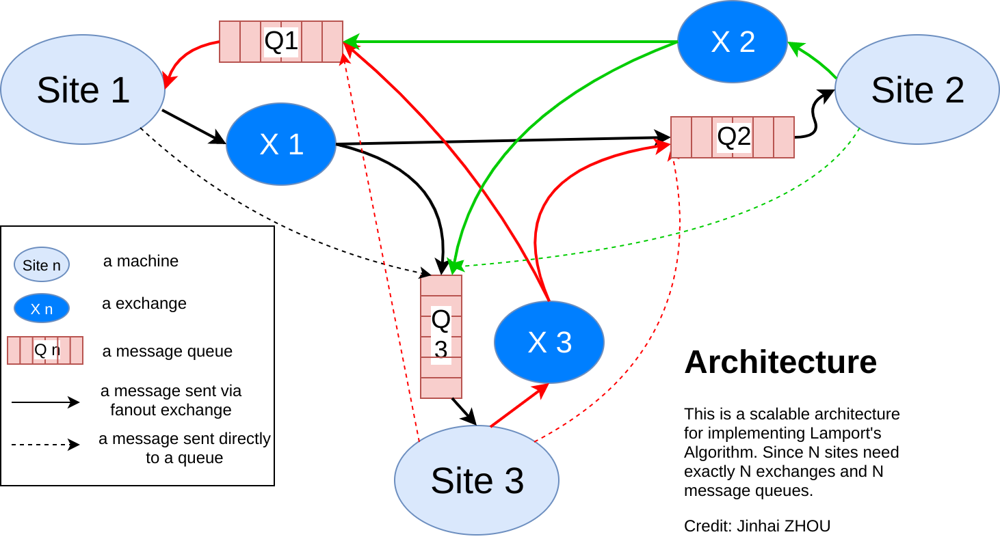

# Lamport's Algorithm implementation based on RabbitMQ

This is an implementation of Lamport's mutual exclusion algorithm for distributed system, 
message sending and receiving are based on [Pika](https://github.com/pika/pika), the python implementaion of RabbitMQ/AMQP

## How to use

For example, if you want to simulate a distributed system with 3 machines, and machine 3 want to get 
into the critical section 2 second after launch, you can modify the senario in the site.py

```python
        if sys.argv[1] == '3':
            time.sleep(2)
            site.request_for_critical_section()
```

then you need launch 3 terminals to simulate 3 machines

 - in terminal 1

    ```bash
    python site.py 1 3
    ```
 - in terminal 2

    ```bash
    python site.py 2 3
    ```
 - in terminal 3

    ```bash
    python site.py 3 3
    ```

the first parameter stands for the id of that site, the second parameter stands for the total number of site

then events like receiving a message, sending a message, entering a critical section, etc will be print to the standard output

## Modules

- requestQ.py implements the request queue data structure base on [heapq](https://docs.python.org/2/library/heapq.html), 
the Pyhton implementaion of the priority queue
- consumer.py implements the majority logic of the Lamport's Algorithm, i.e. Executing the critical section and 
Releasing the critical section, the implementation is based on 
[Pika's Asynchronous consumer example](http://pika.readthedocs.io/en/0.11.0/examples/asynchronous_consumer_example.html)
- publisher.py implements the Requesting the critical section part of the Lamport's Algorithm, the implementation is inspired
by [RabbitMQ's Remote procedure call (RPC) Tutorials](https://www.rabbitmq.com/tutorials/tutorial-six-python.html)
- site.py imitates the behavoir of a machine, it can initiate a request for entering the critical section.
Steps to launch a site is described as below
  1. instantiation a site by calling the class `Site()` and giving 2 parameters, parameters could be string or int, indicate the
  site id(count from 1) and the number of all site respectively.
      ```python
      site = Site(site_id, total_site)
      ```
  2. start the consumer process by calling the `run_consumer_process()` function
      ```python
      site.run_consumer_process()
      ```
  3. define publisher parameters by calling `start_publisher()` function
      ```python
      site.start_publisher()
      ```
  4. initiate a request for entering the critical section by calling `request_for_critical_section()` function
      ```python
      site.request_for_critical_section()
      ```
## Architecture

the architecture is based on RabbitMQ is shown in figure below




## Visualization of message exchanges and queues in RabbitMQ

credit: Florencia Alvarez for the installation code

```bash
sudo rabbitmq-plugins enable rabbitmq_management
sudo rabbitmqctl stop
sudo invoke-rc.d rabbitmq-server start
```

then launch a web browser with http://localhost:15672

## Useful commandes for RabbitMQ

- start RabbitMQ server

    `sudo rabbitmqctl start_app`
- stop RabbitMQ server

    `sudo rabbitmqctl stop_app`
- :warning: reset configuration, histroy messages

    `sudo rabbitmqctl force_reset`

## Useful tutorials:
1. [RabbitMQ Tutorials: Publish/Subscribe(using the Pika Python client)](https://www.rabbitmq.com/tutorials/tutorial-three-python.html)
2. [RabbitMQ Tutorials: Remote procedure call (RPC)(using the Pika Python client)](https://www.rabbitmq.com/tutorials/tutorial-six-python.html)
3. [rabbitmqctl(1) manual page](https://www.rabbitmq.com/man/rabbitmqctl.1.man.html)
3. [Pika Documentation:Asynchronous consumer example](http://pika.readthedocs.io/en/0.11.0/examples/asynchronous_consumer_example.html)


<a rel="license" href="http://creativecommons.org/licenses/by/4.0/"></a><br />This work is licensed under a <a rel="license" href="http://creativecommons.org/licenses/by/4.0/">Creative Commons Attribution 4.0 International License</a>.
